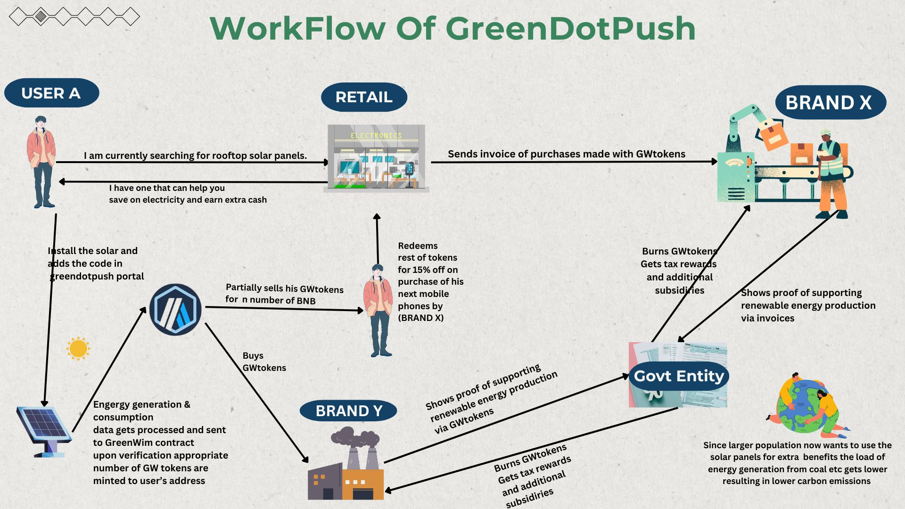

# GreenDotpush

GreenDotPush introduces an innovative ecosystem to accelerate the adoption and generation of renewable energy. With the GenSensor technology, individuals can attach smart sensors to their green energy sources, like solar panels, to track and convert energy production into digital tokens. This mechanism not only encourages renewable energy generation but also allows for the creation and trade of green energy certificates in our marketplace, promoting transparency and economic activity within the green energy sector. Addressing real-world problems, our project directly contributes to reducing the global carbon footprint by providing economic incentives for clean energy usage, thereby making green energy more financially attractive and accessible. Ultimately, our initiative empowers individuals to actively participate in a sustainable energy future, bridging the gap between renewable energy producers and consumers, and fostering a community committed to environmental stewardship.

## Key Features

- **Innovative Sensor Technology:** Tracks and converts renewable energy production into digital tokens, incentivizing green energy generation.
  
- **Green Energy Token Marketplace:** Enables the buying and selling of Tokens that represent renewable energy generation, fostering a transparent and active market.
  
- **Tackles Carbon Footprint:** Directly addresses climate change by motivating individuals and businesses to reduce carbon emissions through renewable energy adoption.
  
- **Economic Incentives for Green Energy:** Offers financial rewards for clean energy production and consumption, making renewable energy investments more attractive.
  
- **Empowers Individuals:** Democratizes energy generation and consumption, creating a community of producers and consumers dedicated to promoting environmental sustainability.

## Getting Started

To get started with GreenDotPush, follow these steps:

1. Clone the repository: `git clone https://github.com/your-username/GreenDotPush.git`
2. Install dependencies: `npm install`
3. Configure your GenSensor devices and connect them to the GreenDotPush platform.
4. Start tracking and converting renewable energy production into digital tokens.
5. Explore the Green Energy Token Marketplace and participate in trading activities.

## sign protocol
For verifying and attesting the data .

